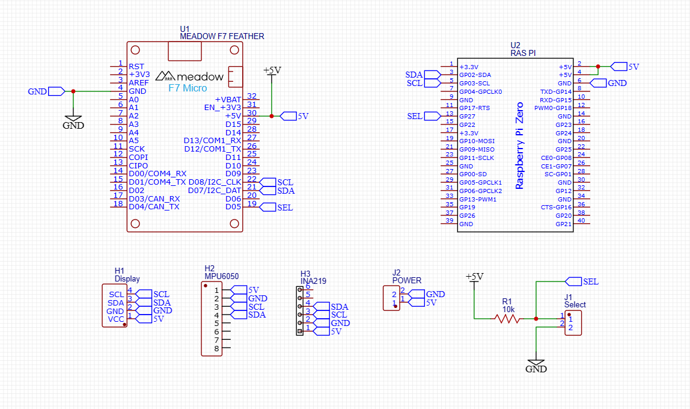

# Yoshimaker Tilt Project

This is a simple embedded project showing how to design cross-platform features in C#.  The goal is to keep parity of features with a Meadow F7, Raspberry Pi Zero 2W and a desktop "simulated" environment.

## Video Series

There are YouTube videos covering some of the more interesting parts of the build.

- [Full Playlist](https://www.youtube.com/playlist?list=PLRE2NnvqCBmrA78riNoEJs2LM5QGnf5rw)  
- [Dotnet on Raspberry Pi](https://youtu.be/sNpG7ZVNQjc)  
- [Raspberry Pi and Meadow Cross-Platform App](https://youtu.be/p3YOopzYMKQ)  
- [Remote Commanding from Meadow Cloud](https://youtu.be/h7_TyzFbRtU)  
- [Configuring from hardware](https://youtu.be/cxtnke1KUNc)  
- [Measuring Power](https://youtu.be/5RCswohoTgE)  
- [Creating a Portable UI](https://youtu.be/mwr9XI3yDHc)
  
## Schematic

## Bill of Materials

If you want more detail, just ask.  The source for these is "probably" since I have loads of stuff in the office and I just pull it off a shelf.

| Item | Source |
| --- | --- |
| Meadow F7 Feather v2 | http://store.wildernesslabs.co |
| Raspberry Pi Zero 2W | Amazon |
| SSD 1306 Display | Amazon |
| Breadboard | Amazon |
| Headers and screw terminals | Amazon |
| MPU6050 Module | Adafruit |
| INA 219 Module | Adafruit |
